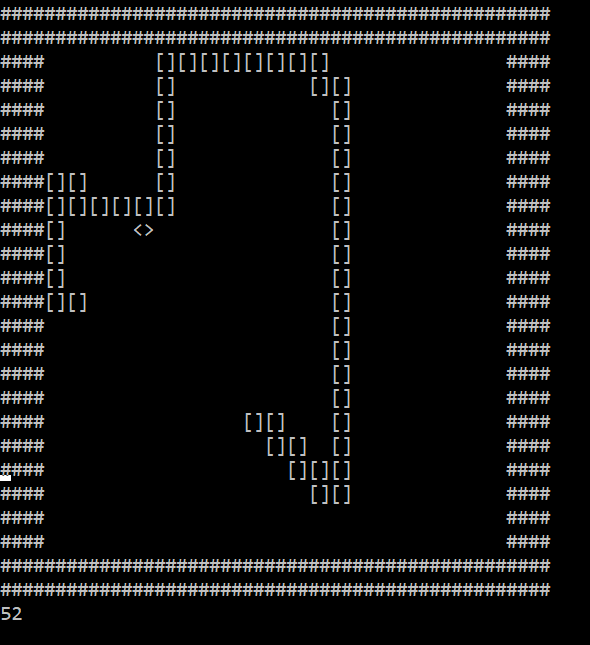

# Snake-Reinforcement-Learning
This is a demonstration of using Q-Learning for the game _Snake_.


## Usage
This is to be run in a Python interactive session in the command line, where ANSI escape codes are supported. Otherwise, printouts will not show properly.
```
import snake
ai = snake.AI(seed=0, epsilon=0.1, alpha=0.1, gamma=0.9, iters=10000)
ai.run(seed=8)
```

## Libraries
The `numpy` library is required.